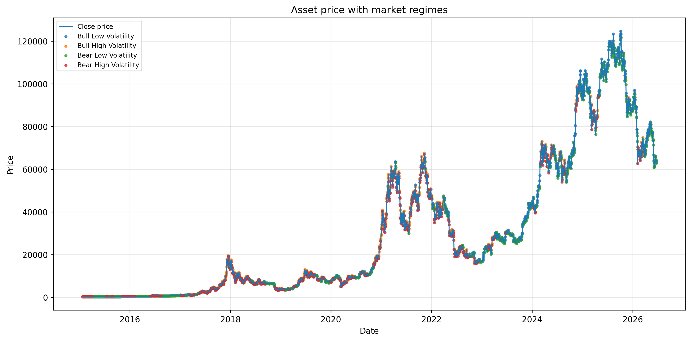
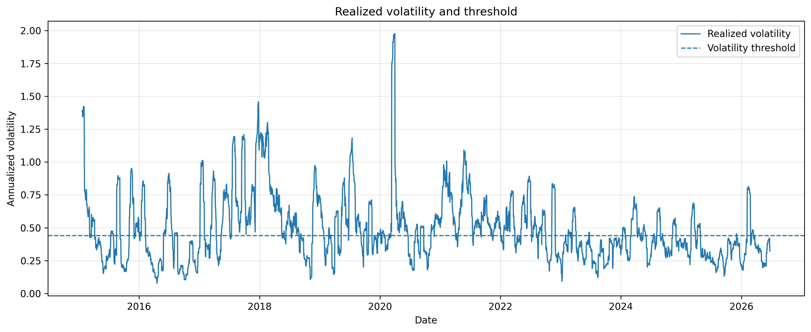
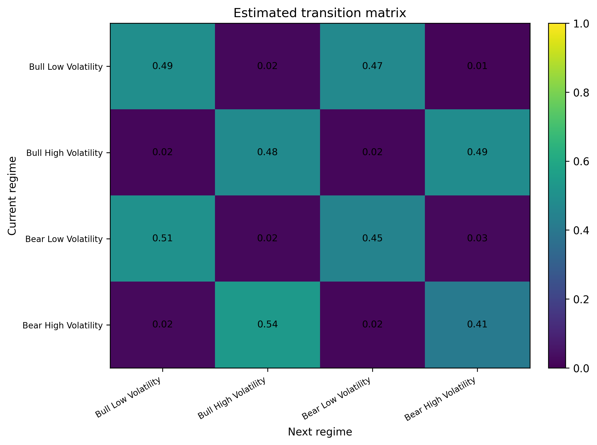
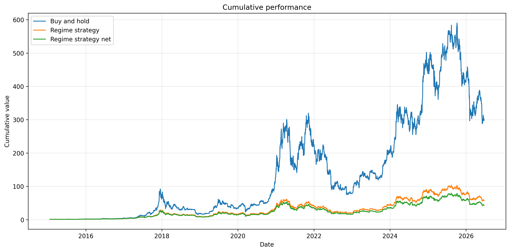
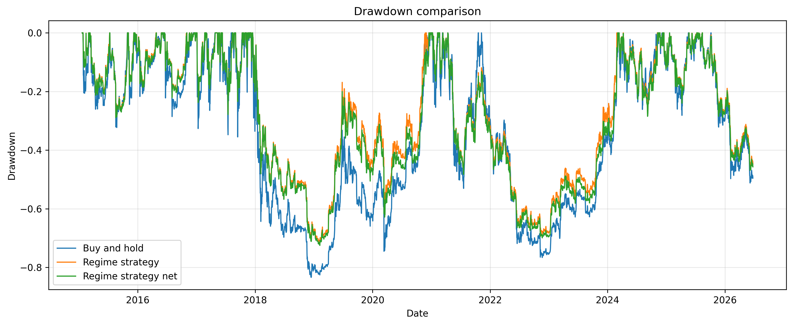

# Market Regime Detection with Markov Chains

A transparent quantitative finance project using discrete-time Markov chains to classify market regimes, estimate regime transition probabilities, and test whether regime persistence can support a simple dynamic risk-management overlay.

## Overview

Financial markets rarely behave homogeneously over time. Periods of calm upward trends, high volatility, drawdowns, and stress episodes tend to alternate. This project builds a simple and interpretable framework to study such market regimes using Markov chains.

The objective is not to predict asset prices directly. Instead, the project investigates whether observable market conditions exhibit enough persistence to support risk-aware portfolio allocation.

The main empirical application uses **BTC-USD daily prices starting in 2015**. BTC-USD is intentionally more volatile than a broad equity index such as SPY, which makes it a useful test case for a regime-based risk overlay.

Starting from historical prices, the project:

1. computes daily log-returns;
2. estimates rolling realized volatility;
3. classifies each trading day into an observable market regime;
4. estimates the transition matrix of the resulting Markov chain;
5. studies regime persistence, stationary probabilities, and expected regime durations;
6. backtests a volatility-targeting allocation rule against buy-and-hold.

This project is designed as a clean baseline before moving to more advanced models such as rolling transition matrices, clustering-based regimes, Markov regime-switching models, or Hidden Markov Models.

## Why This Project?

This project connects several core skills used in quantitative finance:

* probability and Markov chains;
* financial time series analysis;
* volatility estimation;
* maximum likelihood estimation;
* backtesting discipline;
* portfolio risk management;
* Python implementation and reproducible research.

The methodology is deliberately simple and interpretable. The goal is to build a robust baseline rather than a black-box trading model.

## Regime Definition

Each trading day is classified using two observable quantities:

* the sign of the daily log-return;
* the level of realized volatility relative to a chosen threshold.

The four regimes are:

| State | Regime               | Interpretation                            |
| ----: | -------------------- | ----------------------------------------- |
|     1 | Bull Low Volatility  | Positive return, low realized volatility  |
|     2 | Bull High Volatility | Positive return, high realized volatility |
|     3 | Bear Low Volatility  | Negative return, low realized volatility  |
|     4 | Bear High Volatility | Negative return, high realized volatility |

The classification is intentionally simple. It provides an interpretable baseline rather than a fully data-driven regime discovery model.

## Methodology

The project starts from a daily price series. Let `P_t` denote the asset price at date `t`. The daily log-return is defined as:

$$
r_t = \log\left(\frac{P_t}{P_{t-1}}\right)
$$

Realized volatility is estimated over a rolling window of length `w`:

$$
\sigma_t = \sqrt{252} \cdot \mathrm{std}(r_{t-w+1}, \ldots, r_t)
$$

In the main analysis, the rolling window is:

$$
w = 20
$$

Each trading day is then classified into one of four observable regimes using the sign of the log-return and whether realized volatility is above or below its threshold.

The volatility threshold is the median realized volatility in the sample. For BTC-USD, the estimated threshold is:

$$
c = 0.4401
$$

The sequence of regimes is modeled as a finite-state Markov chain. The transition probability from regime `i` to regime `j` is:

$$
p_{ij} = P(X_{t+1}=j \mid X_t=i)
$$

Given the observed regime sequence, the transition matrix is estimated by maximum likelihood:

$$
\hat{p}_{ij} = \frac{N_{ij}}{\sum_{k=1}^{4} N_{ik}}
$$

where `N_ij` is the number of observed transitions from regime `i` to regime `j`.

The estimated transition matrix is then used to study regime persistence, expected regime durations, stationary probabilities, and a simple regime-based allocation strategy.

## Empirical Pipeline

The empirical workflow is:

1. Download daily BTC-USD adjusted close prices.
2. Compute daily log-returns.
3. Estimate rolling realized volatility.
4. Define high-volatility and low-volatility regimes.
5. Classify each trading day into one of four regimes.
6. Estimate transition counts and transition probabilities.
7. Compute persistence and expected regime durations.
8. Compute the stationary distribution implied by the transition matrix.
9. Define a lagged allocation rule based on the previous day’s regime.
10. Backtest the strategy against a buy-and-hold benchmark.
11. Evaluate the results using standard performance metrics.

## Figures

### Asset Price with Regime Classification

This figure displays the BTC-USD historical price and highlights each observation according to its estimated market regime.



### Realized Volatility and Threshold

This figure shows the rolling annualized realized volatility and the threshold used to separate low-volatility and high-volatility regimes.



### Estimated Transition Matrix

The transition matrix summarizes the conditional dynamics of market regimes. Diagonal coefficients measure regime persistence.



### Cumulative Performance

The volatility-targeting regime strategy is compared to a buy-and-hold benchmark.



### Drawdown Comparison

This figure compares the drawdowns of the benchmark and the regime-based strategy.



## Backtesting Discipline

To avoid look-ahead bias, the allocation for day `t` is based only on the regime observed at day `t-1`.

The allocation rule used in the main BTC-USD analysis is a simple volatility-targeting rule:

| Previous regime      | Allocation |
| -------------------- | ---------: |
| Bull Low Volatility  |       100% |
| Bull High Volatility |        75% |
| Bear Low Volatility  |        75% |
| Bear High Volatility |        50% |

This rule does not fully exit the market. Instead, it gradually reduces exposure when the regime becomes more volatile or more defensive. The purpose is to test whether regime information can be used as a risk-management overlay while preserving meaningful upside exposure.

## Performance Metrics

The strategy is evaluated using:

* total return;
* compound annual growth rate;
* annualized log-return;
* annualized volatility;
* Sharpe ratio;
* maximum drawdown;
* total turnover;
* average turnover.

The objective is not only to maximize raw return. A regime-based strategy may still be useful if it reduces drawdowns or improves the risk profile of the portfolio.

## Latest Backtest Results

The table below compares buy-and-hold with the regime-based strategy, before and after transaction costs.

Transaction costs are set to 5 basis points.

| Strategy            | Total Return |   CAGR | Annualized Volatility | Sharpe Ratio | Max Drawdown | Total Turnover |
| ------------------- | -----------: | -----: | --------------------: | -----------: | -----------: | -------------: |
| Buy and Hold        |    27631.97% | 40.46% |                55.10% |         0.62 |      -83.40% |             -- |
| Regime Strategy     |     5632.05% | 27.70% |                39.52% |         0.62 |      -71.68% |         562.50 |
| Regime Strategy Net |     4226.78% | 25.55% |                39.52% |         0.58 |      -72.51% |         562.50 |

The regime-based strategy does not outperform buy-and-hold in raw returns. This is expected for BTC-USD over a strongly upward sample period: remaining fully invested captures the full upside of the asset.

However, the regime-based strategy provides a meaningful risk overlay. Compared with buy-and-hold, the net strategy reduces annualized volatility from approximately 55.10% to 39.52% and improves maximum drawdown from approximately -83.40% to -72.51%, while still preserving a high net CAGR of 25.55%.

This suggests that the Markov regime framework is more useful as a risk-management overlay than as a pure return-enhancement strategy.

## Markov Chain Summary

The fitted Markov chain can be summarized using persistence, expected duration, stationary probability, and the number of outgoing transitions observed in the sample.

| Regime               | Persistence | Expected Duration | Stationary Probability | Outgoing Transitions |
| -------------------- | ----------: | ----------------: | ---------------------: | -------------------: |
| Bull Low Volatility  |      0.4949 |              1.98 |                 0.2620 |                 1087 |
| Bull High Volatility |      0.4778 |              1.92 |                 0.2632 |                 1105 |
| Bear Low Volatility  |      0.4479 |              1.81 |                 0.2408 |                  998 |
| Bear High Volatility |      0.4139 |              1.71 |                 0.2339 |                  981 |

The diagonal terms are below 0.50, which means that regimes are persistent, but not extremely long-lasting at the daily frequency.

The first-order Markov model also fits the observed regime sequence better than an independent-regime benchmark:

| Model | Log-Likelihood |
| ----- | -------------: |
| Markov model | -3578.66 |
| Independent benchmark | -5776.75 |

The likelihood ratio statistic is:

$$
LR = 4396.17
$$

This indicates that conditioning on the current regime substantially improves the fit relative to an independent-regime model.

## Multi-Asset Screening

Before selecting BTC-USD as the main case study, the framework was tested across several assets and allocation rules.

The screened assets included:

| Ticker | Asset |
| ------ | ----- |
| SPY | S&P 500 ETF |
| QQQ | Nasdaq 100 ETF |
| IWM | Russell 2000 ETF |
| EEM | Emerging Markets ETF |
| TLT | Long-Term US Treasuries ETF |
| GLD | Gold ETF |
| BTC-USD | Bitcoin |
| ARKK | Innovation / growth ETF |
| XLE | Energy sector ETF |
| XLF | Financial sector ETF |

Several allocation rules were tested:

| Rule | Description |
| ---- | ----------- |
| Baseline | Reduces exposure aggressively in bear regimes |
| Crash filter | Exits only in Bear High Volatility |
| Defensive overlay | Gradually reduces exposure in defensive regimes |
| Volatility target | Reduces exposure according to regime risk |

The volatility-targeting rule gave the cleanest and most robust story. It preserved meaningful upside while reducing volatility and drawdowns. This is why it was selected for the main BTC-USD analysis.

## Project Structure

```text
markov-market-regimes/
|
|-- README.md
|-- requirements.txt
|-- .gitignore
|
|-- report/
|   |-- markov_market_regimes.pdf
|   |-- markov_market_regimes.tex
|
|-- notebooks/
|   |-- 01_markov_market_regimes.ipynb
|
|-- src/
|   |-- data.py
|   |-- features.py
|   |-- regimes.py
|   |-- markov.py
|   |-- backtest.py
|   |-- plots.py
|   |-- screen_assets.py
|
|-- figures/
|   |-- regimes_over_time.png
|   |-- volatility_threshold.png
|   |-- transition_matrix_heatmap.png
|   |-- strategy_vs_benchmark.png
|   |-- drawdown_comparison.png
|
|-- data/
|   |-- .gitkeep
```

## Installation

Clone the repository:

```bash
git clone https://github.com/your-username/markov-market-regimes.git
cd markov-market-regimes
```

Create a virtual environment:

```bash
python -m venv .venv
source .venv/bin/activate
```

On Windows:

```bash
python -m venv .venv
.venv\Scripts\activate
```

Install dependencies:

```bash
pip install -r requirements.txt
```

## Running the Project

First, download and save the BTC-USD price data:

```bash
python src/data.py
```

Then run the individual modules:

```bash
python src/features.py
python src/regimes.py
python src/markov.py
python src/backtest.py
python src/plots.py
```

To run the multi-asset and multi-rule screening:

```bash
python src/screen_assets.py
```

Alternatively, run the full notebook:

```bash
jupyter notebook notebooks/01_markov_market_regimes.ipynb
```

The generated figures are saved in the `figures/` folder.

## Report

A short mathematical report is available in the `report/` folder. It presents the probabilistic framework, the Markov chain model, the maximum likelihood estimator of the transition matrix, and the interpretation of regime persistence.

## Possible Extensions

This project is intentionally simple and interpretable. Natural extensions include:

* estimating rolling transition matrices;
* using quantile-based or adaptive volatility thresholds;
* comparing the Markov model to an independent regime model;
* using clustering to define regimes;
* implementing Hidden Markov Models;
* estimating regime-conditional expected returns and variances;
* deriving allocation rules from a mean-variance or utility maximization problem;
* adding more realistic transaction costs, slippage, and cash returns;
* extending the framework to multi-asset portfolio allocation;
* calibrating the exposure rule to a fixed annual volatility target.

## Disclaimer

This project is for educational and research purposes only. It does not constitute investment advice. The strategy implemented here is a simplified illustration of regime-based allocation and should not be used for live trading without further validation.

## Author

**Arthus Goujon**  
Mathematics & Economics student interested in quantitative finance, probability, financial markets, and applied modeling.

Website: [arthusgoujon.xyz](https://arthusgoujon.xyz)
